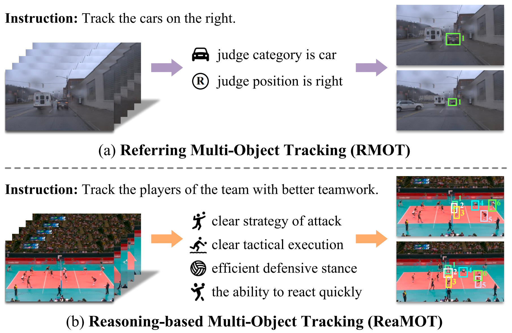

# 🚀 ReaMOT: A Benchmark and Framework for Reasoning-based Multi-Object Tracking

> [**ReaMOT: A Benchmark and Framework for Reasoning-based Multi-Object Tracking**](https://arxiv.org/abs/2505.20381)              
> Sijia Chen *, Yanqiu Yu *, En Yu *, Wenbing Tao   
> Huazhong University of Science and Technology                       
> *[ArXiv] Paper ([https://arxiv.org/abs/2505.20381](https://arxiv.org/abs/2505.20381))*

**Note:** 

Upon acceptance of our paper, we will fully open-source our **ReaMOT Challenge benchmark** (including its dataset and evaluation code) and **ReaTrack framework** (including its code and model weights) **within one month**, **just like our [**CRMOT**](https://github.com/chen-si-jia/CRMOT) project**.

Thanks for your attention! If you are interested in our work, please give us a star ⭐️.


## 🔍 ReaMOT vs RMOT



**Comparison between RMOT and ReaMOT tasks.**

(a) Standard RMOT task relies on explicit attribute (e.g., "car", "right") matching.

(b) The **ReaMOT** task requires models to identify and track targets that satisfy implicit constraints (e.g., "better teamwork") via logical reasoning.


## ✨ Abstract
Referring Multi-Object Tracking (RMOT) aims to track targets specified by language instructions. However, existing RMOT paradigms are largely designed for explicit instructions and consequently fail to generalize to complex instructions that require logical reasoning. To overcome this, we propose Reasoning-based Multi-Object Tracking (ReaMOT), a novel task that requires models to identify and track targets that satisfy implicit constraints via logical reasoning. To advance this field, we construct the ReaMOT Challenge, a comprehensive benchmark comprising: (1) a large-scale dataset with 1,156 instructions categorized into High-Level Reasoning and Low-Level Perception, covering 423,359 image-language pairs across 869 diverse scenes; and (2) a tailored metric suite designed to jointly evaluate reasoning accuracy and tracking robustness. Furthermore, we propose ReaTrack, a training-free framework that synergizes the reasoning capabilities of Thinking-variant Large Vision-Language Model (LVLM) with the precise temporal modeling of SAM2. Extensive experiments on the ReaMOT Challenge benchmark demonstrates the effectiveness of our ReaTrack framework.


## ✏️ Citation
```
@article{chen2025reamot,
  title={ReaMOT: A Benchmark and Framework for Reasoning-based Multi-Object Tracking},
  author={Chen, Sijia and Yu, Yanqiu and Yu, En and Tao, Wenbing},
  journal={arXiv preprint arXiv:2505.20381},
  year={2025}
}
```
