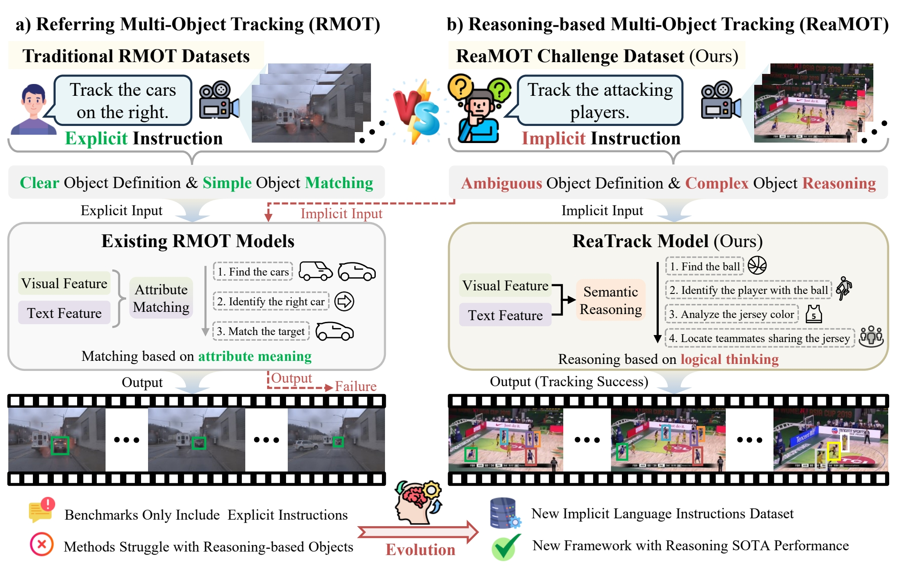

# 🚀 ReaMOT: A Benchmark and Framework for Reasoning-based Multi-Object Tracking

> [**ReaMOT: A Benchmark and Framework for Reasoning-based Multi-Object Tracking**](https://arxiv.org/abs/2505.20381)              
> Sijia Chen *, Yanqiu Yu *, En Yu *, Wenbing Tao   
> Huazhong University of Science and Technology                       
> *[ArXiv] Paper ([https://arxiv.org/abs/2505.20381](https://arxiv.org/abs/2505.20381))*

**Note:** 

Upon acceptance of our paper, we will **fully open-source** our ReaMOT Challenge benchmark and ReaTrack framework **within a week**, just like our [**CRMOT [AAAI 2025]**](https://github.com/chen-si-jia/CRMOT) , [**Trajectory-Long-tail-Distribution-for-MOT [CVPR 2024]**](https://github.com/chen-si-jia/Trajectory-Long-tail-Distribution-for-MOT) projects.

Thanks for your attention! If you are interested in our work, please give us a star ⭐️.


## 🔍 ReaMOT vs RMOT



**Comparison between the traditional RMOT and the proposed ReaMOT tasks.**

(a) The traditional **RMOT** task relies on explicit visual attribute matching (e.g., "car", "right"). Consequently, existing models designed for this standard paradigm fail when confronted with implicit language instructions. 

(b) In contrast, the **ReaMOT** task elevates the tracking process to a cognitive level. It requires models to infer and track the specific targets that satisfy implicit semantic constraints (e.g., "attacking players") through multiple steps of logical reasoning.


## ✏️ Citation
```
@article{chen2025reamot,
  title={ReaMOT: A Benchmark and Framework for Reasoning-based Multi-Object Tracking},
  author={Chen, Sijia and Yu, Yanqiu and Yu, En and Tao, Wenbing},
  journal={arXiv preprint arXiv:2505.20381},
  year={2025}
}
```
