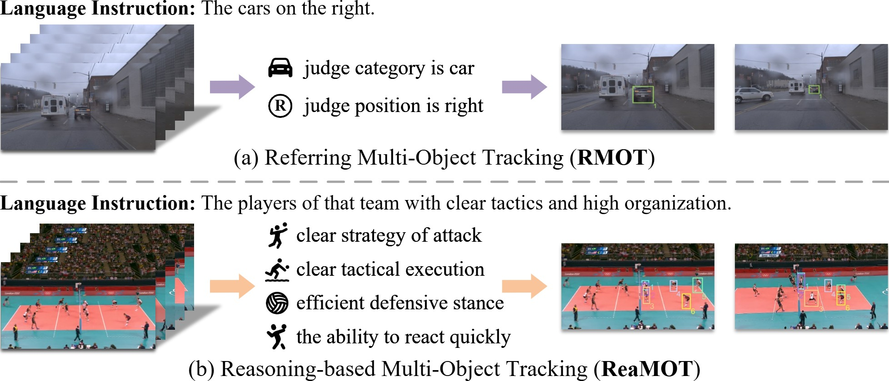

# 🚀 ReaMOT: A Benchmark and Framework for Reasoning-based Multi-Object Tracking

> [**ReaMOT: A Benchmark and Framework for Reasoning-based Multi-Object Tracking**](https://arxiv.org/abs/2412.17807)            
> Sijia Chen *, Yanqiu Yu *, En Yu *, Wenbing Tao                 
> *[ArXiv] Paper ([https://arxiv.org/abs/2412.17807](https://arxiv.org/abs/2412.17807))*           

**Note:** We will fully open-source our **ReaMOT Challenge benchmark** (including its dataset and evaluation metrics code) and **ReaTrack framework** (including its code and model weights) **after the paper is accepted**, just like our [**CRMOT**](https://github.com/chen-si-jia/CRMOT)  project.


Thanks for your attention! If you are interested in our work, please give us a star ⭐️.


## Highlights of the ReaMOT task



As shown in the above Figure (a), for the language instruction "The cars on the right.", the models of the RMOT task only need to track the cars on the right, as referred to by the language instruction, without going through a series of complex reasoning processes. 

**In contrast**, as shown in the above Figure (b), for the language instruction "The players of that team with clear tactics and high organization.", the ReaMOT task requires the models to engage in a deep reasoning process, analyzing aspects such as offensive strategies, tactical execution, defensive positioning, and reaction speed of both teams, to accurately deduce the players of the target team that match the language instruction and track their trajectories.


## Abstract
Referring Multi-object tracking (RMOT) is an important research field in computer vision. Its task form is to guide the models to track the objects that conform to the language instruction. However, the RMOT task commonly requires clear language instructions, such methods often fail to work when complex language instructions with reasoning characteristics appear. In this work, we propose a new task, called **Rea**soning-based **M**ulti-**O**bject **T**racking (**ReaMOT**). ReaMOT is a more challenging task that requires accurate reasoning about objects that match the language instruction with reasoning characteristic and tracking the objects' trajectories. To advance the ReaMOT task and evaluate the reasoning capabilities of tracking models, we construct **ReaMOT Challenge**, a reasoning-based multi-object tracking benchmark built upon 12 datasets. Specifically, it comprises 1,156 language instructions with reasoning characteristic, 423,359 image-language pairs, and 869 diverse scenes, which is divided into three levels of reasoning difficulty. In addition, we propose a set of evaluation metrics tailored for the ReaMOT task. Furthermore, we propose **ReaTrack**, a training-free framework for reasoning-based multi-object tracking based on large vision-language models (LVLM) and SAM2, as a baseline for the ReaMOT task. Extensive experiments on the ReaMOT Challenge benchmark demonstrate the effectiveness of our ReaTrack framework.


## Quantitative Results
### Table: Performance of many methods on the test set of the ReaMOT Challenge benchmark under zero-shot conditions. ↑ indicates that higher score is better. The best results are marked in **bold**.

| Method              | Published     | Easy RIDF1↑   | Easy RMOTA↑    | Easy RRcll↑    | Easy RPrcn↑    | Medium RIDF1↑  | Medium RMOTA↑  | Medium RRcll↑  | Medium RPrcn↑  | Hard RIDF1↑      | Hard RMOTA↑      | Hard RRcll↑      | Hard RPrcn↑      |
|---------------------|---------------|---------------|----------------|----------------|----------------|----------------|----------------|----------------|----------------|------------------|------------------|------------------|------------------|
| TransRMOT[1]        | CVPR2023      | 3.08          | 1.28           | 2.89           | 11.08          | 2.55           | 0.70           | 2.18           | 12.19          | 1.55             | 0.09             | 1.67             | 8.27             |
| TempRMOT[2]         | ArXiv2024     | 5.20          | 2.17           | 4.56           | 15.22          | 4.75           | 2.01           | 3.94           | 15.57          | 2.13             | 0.76             | 1.72             | 8.43             |
| **ReaTrack (Ours)** | -             | **40.18**     | **13.45**      | **60.18**      | **37.36**      | **39.63**      | **14.24**      | **58.11**      | **37.50**      | **39.63**        | **13.29**        | **57.02**        | **36.30**        |

References:

[1] Wu D, Han W, Wang T, et al. Referring multi-object tracking[C]//Proceedings of the IEEE/CVF conference on computer vision and pattern recognition. 2023: 14633-14642.

[2] Zhang Y, Wu D, Han W, et al. Bootstrapping Referring Multi-Object Tracking[J]. arXiv preprint arXiv:2406.05039, 2024.


## Citation
```

```


